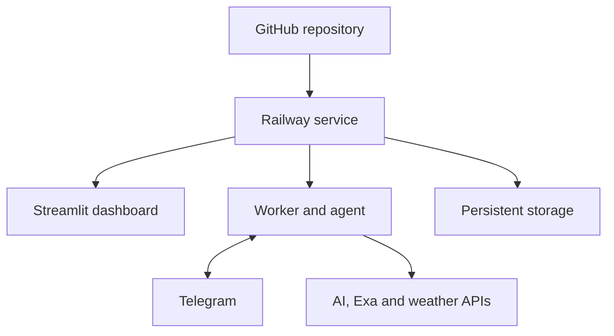

# Machine2Pipe AI

**An AI field engineer that connects pipe design, real machine telemetry, and the engineer through Telegram.**

Built by **Caio Zanetti / Ctrl+Alt+Construct** for the AI Tinkerers **Agents, Everywhere** hackathon.

## Demo assets

- **Real 2022 telemetry:** [gps_maquina](https://github.com/CAIOZANETTI/gps_maquina)
- **Construction photo album:** [ait_machine2pipe-ai — Google Photos](https://photos.app.goo.gl/Bw5BuCvfpGf4eskXA)
- **Georeferenced pipe project:** [calmon_jit_machine2pipe-ai — Google Earth](https://earth.google.com/earth/d/1AxktfRe0YqqKtn-7T0XMgNEnYQQTGYa8?usp=sharing)

The public links provide visual traceability for the demo. Runtime processing uses the original Parquet file, original photo files, and an exported KML/KMZ file rather than scraping the shared pages.

## Objective

Machine2Pipe AI answers four practical questions:

1. Where is the machine?
2. Which planned pipe segment is it near?
3. What operational event is supported by the telemetry?
4. What must the field engineer confirm?

The system never treats GPS presence as proof of installed pipe. Python calculates the evidence; the AI agent interprets it and asks the engineer for confirmation in Telegram.

## MVP scenario

A historical day from a real JCB 3CX construction project is replayed as if it were live.

1. The worker reads the next telemetry window.
2. Python matches the machine to the nearest pipe segment.
3. Deterministic rules detect a relevant event.
4. The agent receives the structured event and project context.
5. The agent decides to log, notify, or ask.
6. Telegram sends the message to the engineer.
7. The engineer replies in natural language.
8. The agent converts the reply into a structured, auditable record.
9. The dashboard shows the confirmed progress.

## Inputs

### 1. Real machine telemetry

Source: [gps_maquina](https://github.com/CAIOZANETTI/gps_maquina)

Preferred file:

```text
data/silver_jcb_relatorio_2022.parquet
```

The application will download or read this file through a configured URL. The original repository remains the source of truth; the full dataset does not need to be duplicated here.

| Canonical field | Source field | Use |
|---|---|---|
| `timestamp` | `data_hora` | Event time |
| `latitude` | `lat` | Machine position |
| `longitude` | `lon` | Machine position |
| `event_type` | `atividade` | Raw telemetry event |
| `engine_on` | `motor_ligado` | Engine state |
| `movement_m` | `raio_m` or recalculated | Movement between points |

The first development task is to validate the real Parquet schema before fixing this adapter.

### 2. Pipe project in KML/KMZ

Public visualization: [calmon_jit_machine2pipe-ai — Google Earth](https://earth.google.com/earth/d/1AxktfRe0YqqKtn-7T0XMgNEnYQQTGYa8?usp=sharing)

The demo project is drawn in Google Earth and exported as KML/KMZ for processing.

Supported geometry:

- **LineString:** pipe segment;
- **Point:** manhole, catch basin, inspection chamber, or accessory.

Recommended fields in KML `ExtendedData`:

| Field | Example |
|---|---|
| `segment_id` | `TR-04` |
| `name` | `Rua A — Rua B` |
| `service_type` | `drainage_pipe` |
| `diameter_mm` | `400` |
| `material` | `concrete` |
| `planned_length_m` | `300` |
| `planned_start` | `2022-04-18` |
| `planned_end` | `2022-04-19` |

Reference implementations:

- [kml_saneamento](https://github.com/CAIOZANETTI/kml_saneamento)
- [kml-earthworks](https://github.com/CAIOZANETTI/kml-earthworks)

### 3. Environmental context

- Terrain elevation: Open-Meteo Elevation API, with OpenTopoData fallback.
- Historical rain/weather: Open-Meteo Archive API.

These values provide context only. They are not survey-grade elevation or an on-site rain gauge.

### 4. Field photos

Source album: [ait_machine2pipe-ai — 2022 construction photos](https://photos.app.goo.gl/Bw5BuCvfpGf4eskXA)

In operation, users send original photos to the Telegram bot. The system extracts capture time and GPS when available, matches the photo to the nearest project segment and telemetry window, and classifies it as:

- execution evidence;
- operational evidence;
- technical evidence;
- material/logistics evidence;
- informative only.

The vision model may describe visible conditions, but depth and installed quantity require a scale reference or engineer confirmation.

### 5. Engineer messages

Telegram supplies field information that telemetry cannot prove:

- installed length;
- activity performed;
- stoppage reason;
- incident or obstruction;
- confirmation or correction of the detected segment.

## Processing

### Deterministic Python engine

Python is responsible for:

- validating coordinates and timestamps;
- converting coordinates to a metric CRS;
- calculating point-to-alignment distance;
- identifying the nearest segment and chainage;
- reconstructing engine state and movement;
- calculating dwell and inactivity time;
- retrieving elevation and weather;
- applying event thresholds;
- calculating confirmed totals.

### AI agent

The agent receives compact structured events, not the complete Parquet file. It is responsible for:

- interpreting the event in project context;
- choosing `ignore`, `log`, `notify`, or `ask`;
- writing a concise Telegram message;
- understanding the engineer's reply;
- calling approved Python tools;
- producing a daily summary.

The agent does not calculate distances, invent production, or control equipment.

### Exa AI

Exa is an **optional research tool** for the agent. It can search current technical sources when a specific external question appears, for example:

- meaning of an unfamiliar telemetry or diagnostic event;
- official machine documentation;
- technical context about a pipe material or construction method.

Exa is not used for geometry, weather, persistence, or routine event processing. It also does not replace the language model that powers the agent.

## Deterministic events

| Event | Initial rule | Output |
|---|---|---|
| `entered_segment` | Machine enters the project corridor | Log active segment |
| `left_segment` | Machine leaves the corridor | Close activity window |
| `outside_project` | Engine on outside the corridor | Notify engineer |
| `long_dwell` | Engine on with little movement | Ask activity/stoppage |
| `unexpected_segment` | Location conflicts with schedule | Notify engineer |
| `gps_gap` | Missing GPS beyond threshold | Data-quality alert |
| `rain_context` | Rain overlaps low activity | Add context only |
| `progress_unconfirmed` | Activity window ends without record | Ask for confirmation |

All thresholds will be stored in configuration, never hidden inside the prompt.

## Outputs

### Telegram

Example proactive message:

> JCB-3CX remained near segment TR-04 for 1h35 with the engine on. DN400 drainage pipe is planned here, and rain was recorded during the period. Was work completed or interrupted?

Example reply:

> We installed 32 meters and stopped because of rain.

### Structured progress record

```json
{
  "event_id": "evt_2022-04-18_001",
  "machine_id": "JCB-3CX",
  "segment_id": "TR-04",
  "confirmed_length_m": 32,
  "status": "partially_completed",
  "interruption_reason": "rain",
  "confirmed_by": "engineer",
  "source": "telegram",
  "timestamp": "2022-04-18T17:40:00-03:00"
}
```

### Dashboard

The Streamlit dashboard will show:

- project alignment and structures;
- machine route and current simulated position;
- active segment and chainage;
- engine and movement status;
- detected events;
- confirmed progress by segment;
- planned versus confirmed quantities;
- elevation and weather context.

### Daily summary

The agent will report:

- machine operating window;
- segments visited;
- relevant events and anomalies;
- confirmed installed length;
- interruptions and stated causes;
- open questions requiring engineer confirmation.

## Telegram interface

Planned commands:

| Command | Response |
|---|---|
| `/status` | Current machine and active segment |
| `/segment` | Scope of the active segment |
| `/progress` | Confirmed progress by segment |
| `/events` | Recent operational events |
| `/summary` | Daily summary |
| `/help` | Commands and limitations |

For the hackathon MVP, the bot will run by long polling inside the Railway worker. Telegram does not host the Python application.

## Web deployment

The MVP is web-first. The GitHub repository is deployed to Railway, so the application continues running when the developer's computer is off.

- **Streamlit:** public dashboard and initial KML/KMZ upload.
- **Worker:** telemetry replay, Telegram long polling, photo processing, and agent calls.
- **Persistent volume:** SQLite database, uploaded project, and downloaded photos.
- **External APIs:** Telegram, vision/language model, Exa, Open-Meteo, and OpenTopoData.

Streamlit Community Cloud may be used later for a dashboard-only deployment, but it is not the primary runtime for the always-on worker.

## Architecture



## Technology

| Layer | Choice |
|---|---|
| Language | Python 3.11+ |
| Data | pandas, PyArrow |
| Geospatial | Shapely, PyProj |
| KML/KMZ | fastkml or lxml, zipfile |
| Agent model | OpenAI API or OpenRouter-compatible model |
| Web research | Exa API |
| Messaging | Telegram Bot API |
| Weather/elevation | Open-Meteo, OpenTopoData |
| Dashboard | Streamlit, Plotly/PyDeck |
| Validation | Pydantic |
| MVP storage | SQLite + persistent volume |
| Tests | pytest |
| Hosting | Railway |

> The Exa credit pays for Exa searches. A separate model provider is still required for language reasoning.

## Repository structure

```text
machine2pipe-ai/
├── app/
│   └── streamlit_app.py
├── src/machine2pipe/
│   ├── agent.py
│   ├── config.py
│   ├── events.py
│   ├── replay.py
│   ├── photos.py
│   ├── storage.py
│   ├── telegram_bot.py
│   ├── tools.py
│   ├── weather.py
│   ├── geo/
│   │   ├── matching.py
│   │   ├── project_loader.py
│   │   └── stationing.py
│   └── telemetry/
│       ├── adapter_jcb_2022.py
│       └── loader.py
├── data/
│   ├── sample/
│   ├── photos/
│   └── output/
├── docs/
│   └── IMPLEMENTATION_PLAN.md
├── tests/
├── .env.example
├── .gitignore
├── AGENTS.md
├── Dockerfile
├── railway.toml
├── requirements.txt
├── start.sh
└── worker.py
```

## Configuration

```dotenv
TELEMETRY_URL=
PROJECT_KMZ_PATH=/data/project.kmz
DATABASE_PATH=/data/machine2pipe.db
PHOTO_STORAGE_PATH=/data/photos

TELEGRAM_BOT_TOKEN=
TELEGRAM_CHAT_ID=

LLM_PROVIDER=openai
OPENAI_API_KEY=
OPENROUTER_API_KEY=
LLM_MODEL=

EXA_API_KEY=

REPLAY_SPEED=600
PROJECT_CORRIDOR_M=15
LONG_DWELL_MINUTES=45
```

Never commit API keys, Telegram tokens, private files, or an unapproved telemetry dataset.

## Build plan

### Phase 0 — Deploy the web foundation

- [ ] Add Dockerfile, Railway configuration, start command, and health check.
- [ ] Create the persistent `/data` volume.
- [ ] Configure secrets outside GitHub.
- [ ] Deploy a minimal Streamlit dashboard and worker.

**Deliverable:** public dashboard and always-on worker running from GitHub.

### Phase 1 — Prove the data connection

- [ ] Audit the real Parquet columns and dates.
- [ ] Create the JCB 2022 adapter.
- [ ] Create the Google Earth demo KMZ in the telemetry area.
- [ ] Parse lines, points, and project attributes.
- [ ] Plot telemetry and project together.

**Deliverable:** machine path and pipe project on one map.

### Phase 2 — Build the engineering engine

- [ ] Match GPS points to segments.
- [ ] Calculate chainage, distance, movement, and dwell.
- [ ] Implement configurable event rules.
- [ ] Add elevation and historical weather.
- [ ] Write structured events to SQLite.

**Deliverable:** reproducible events without AI.

### Phase 3 — Put the agent in Telegram

- [ ] Create the Telegram bot.
- [ ] Receive and store original photos.
- [ ] Extract EXIF time and GPS.
- [ ] Match photos to segments and telemetry windows.
- [ ] Add vision classification with confidence and limitations.
- [ ] Implement status and progress commands.
- [ ] Connect the language model.
- [ ] Expose approved Python tools to the agent.
- [ ] Parse engineer replies into validated records.
- [ ] Add Exa as an optional technical-search tool.

**Deliverable:** two-way field conversation with auditable tool calls.

### Phase 4 — Demonstrate the complete loop

- [ ] Replay one historical construction day.
- [ ] Trigger at least one meaningful event.
- [ ] Ask the engineer for confirmation.
- [ ] Record the answer and update progress.
- [ ] Show the result in Streamlit.
- [ ] Record the hackathon demo.

## Definition of done

The MVP is complete when one reproducible demonstration proves this sequence:

```text
real Parquet + KML/KMZ + photo → matched project segment → deterministic event
→ agent decision → Telegram question → engineer reply → confirmed record → dashboard update
```

## Critical limitations

- GPS proximity does not prove installed pipe.
- Public elevation is not suitable for grade or invert control.
- Historical weather is contextual, not a site measurement.
- Telemetry does not identify every construction activity.
- The prototype supports engineering decisions; it does not command machinery.

## Prior work

This hackathon project builds on public work created by Caio Zanetti:

- [gps_maquina](https://github.com/CAIOZANETTI/gps_maquina) — real JCB 3CX telemetry and operational analysis from 2022.
- [kml_saneamento](https://github.com/CAIOZANETTI/kml_saneamento) — KML sanitation-network parsing and QA/QC.
- [kml-earthworks](https://github.com/CAIOZANETTI/kml-earthworks) — alignment, chainage, elevation, and terrain profiles.
- [kml_poligono](https://github.com/CAIOZANETTI/kml_poligono) — polygon and earthworks geospatial analysis.

The agent, Telegram workflow, telemetry-to-project matching, and confirmation loop are new work for Machine2Pipe AI.
